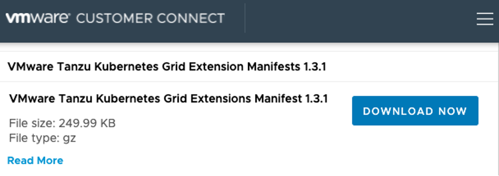
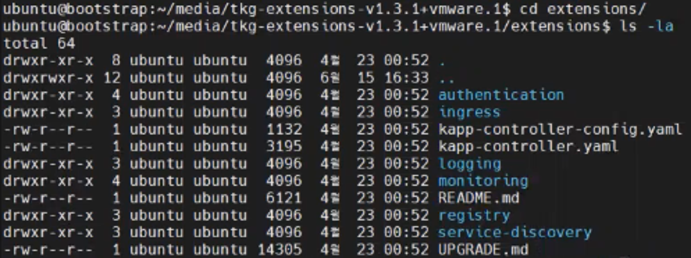
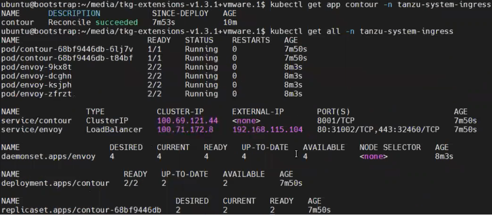
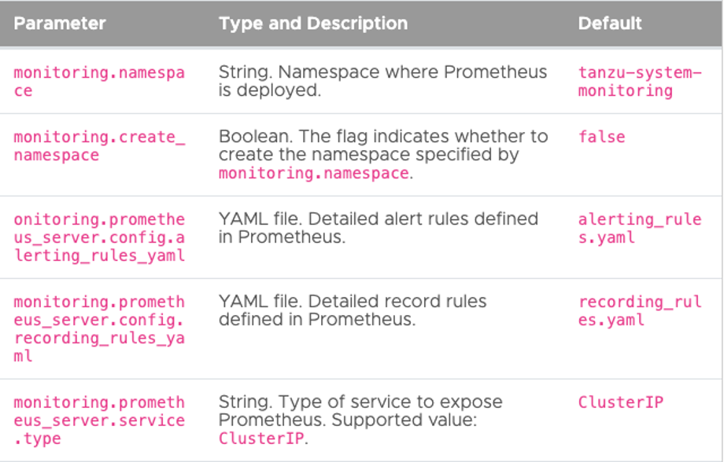
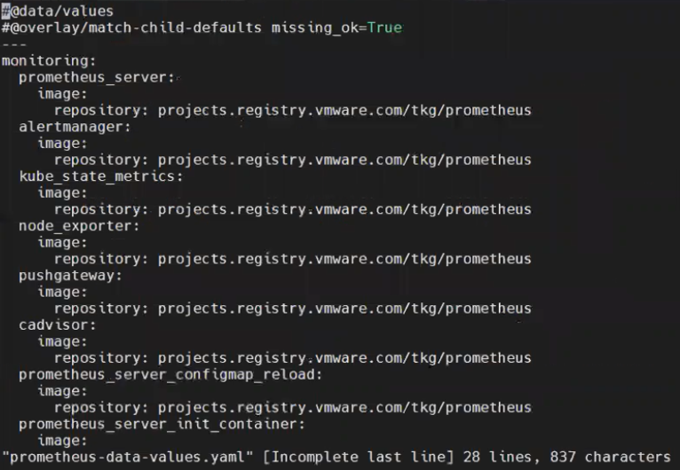
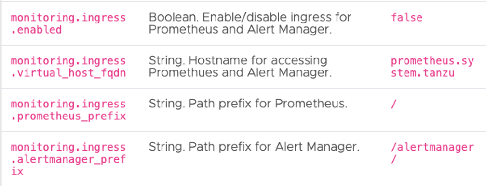
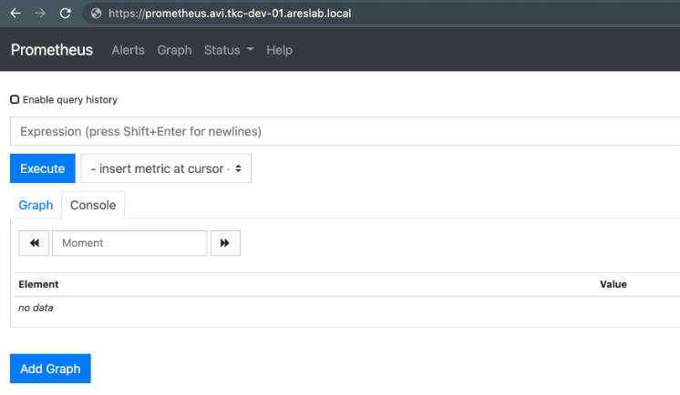

## Extension 설치
### 개요 및 개념
#### Extension

기존에 오픈소스로 제공되는 툴 중 Taznu Kubernetes Cluster에 추가적인
기능을 제공하기 위한 일부 툴을 VMware에서 관리 및 지원하는 형태로
이미지를 제공하는 것입니다. 모든 바이너리 및 컨테이너 이미지는 VMware가
빌드 및 서명합니다. 현재, Contour, External DNS, Fluent Bit, Harbor,
Prometheus, Grafana가 extension으로 제공되고 있으며, 이 중, Fluent Bit와
Harbor는 Tanzu Basic 라이선스 부터 모두 제공이 되고 있습니다. 그 외
Extension의 경우, 라이선스에 따라 상이하게 지원 됩니다.\
\
Extension을 배포하기 위해서는 몇가지 사전 요구사항이 있습니다. 우선,
kubectl과 Carvel tools가 부트스트랩 상에 설치 되어야합니다. 해당 CLI
tool을 통해 Extension을 배포하는 데에 필요한 ytt, kapp, kbld 등의
명령어들이 제공될 수 있습니다.

#### Contour

Contour는 쿠버네티스 환경의 인그레스를 관리하기 위한 인그레스 컨트롤러를
제공합니다. L7 트래픽 및 데이터를 처리하며, HTTP URL에 대한 핸들링, TLS
인증서에 대한 처리가 가능합니다. 로드 밸런서 및 노드 포트의 형태로
expose를 할 수 있습니다.\
Contour는 다른 extension인 Harbor, External DNS 그리고 Grafana가 모두
사전에 설치할 것을 요구하는 툴이기 때문에 가장 먼저 설치할 것을 권장
드립니다.

#### Prometheus

Prometheus는 모니터링을 위해 쿠버네티스 환경 내부의 메트릭을 수집하는
역할을 수행하며, 경고 기능을 함께 제공하는 툴입니다TKC 상의 서비스를
모니터링 할 수 있습니다. Grafana를 사용하기 위해서는 Prometheus의 설치가
선행되어야 합니다.

#### Grafana

Grafana는 쿠버네티스 클러스터 상에서 수집된 메트릭 값을 분석하여,
그래픽화 된 정보를 대시보드로 제공합니다. 데이터 수집을 위해
Prometheus의 설치가 필요합니다.

### Extension 설치 방법

#### 공식 문서 참조

각 extension에 대해 VMware 공식 문서를 통한 설치 방법이 안내되고
있습니다. 다음의 링크를 참조하여 각 환경 또는 용도에 맞는 방법을
확인하여 설치를 진행할 것을 권장 드립니다.

참조 :
<https://docs.vmware.com/en/VMware-Tanzu-Kubernetes-Grid/1.3/vmware-tanzu-kubernetes-grid-13/GUID-extensions-index.html>

#### TKG Extension 번들 다운로드

Extension은 바이너리 형태의 번들로 제공됩니다. 부트스트랩 상에서 해당
바이너리를 활용할 수 있도록 다운로드한 후 이후의 단계를 따라 설치할 수
있습니다.

(1) VMware Product Download 페이지에서 VMware Tanzu Kubernetes Grid
    Extensions Manifests를 다운로드 합니다.

tar -xzf tkg-extensions-manifests-v1.3.1-vmware.1.tar.gz

(2) 다운로드한 번들 파일이 부트스트랩 상에서 활용될 수 있도록 적절한
    위치에 저장된 것을 확인한 후 압축해제 합니다. 본 매뉴얼의 예시에서는
    위와 같은 명령어를 활용하였습니다.

(3) 압축을 해제한 번들 파일의 내부에 위치한 /extensions 디렉토리로
    이동합니다. 상위 디렉토리에 동일한 이름의 폴더 및 파일이 존재하나,
    이는 사전에 정해진 기본 구성값이므로 변경하지 않습니다. 실제로
    배포를 진행하며 활용하는 폴더 및 파일은 해당 디렉토리에 위치하므로
    주의하여 이후의 단계를 진행합니다.

#### kapp-controller & cert-manager 설치

사전에 cert-manager가 생성되어야 이후 단계에서 extension 생성 및 배포 시
워크로드 클러스터 상에서 자동화된 인증서 관리 기능을 제공 받을 수
있습니다. 관리 클러스터의 경우에는 기본적으로 동작을 하지만 워크로드
클러스터의 경우에는 다음과 같이 별도로 구성해야 합니다. Cert-manager를
사용하고자 하는 워크로드 클러스터에 접속 후 다음 단계를 진행합니다.

cd /\[압축해제 된 번들 폴더\]/

(1) extension 번들 내에 cert-manager 디렉토리가 있는 것을 확인합니다.

kubectl apply -f cert-manager/

(2) cert-manager extension을 워크로드 클러스터 상에 배포합니다.

#### Contour 설치(Ingress)

cd /\[압축해제 된 번들 폴더\]/extensions/

kubectl config get-contexts

kubectl apply -f ingress/contour/namespace-role.yaml

(1) /\[압축해제 된 번들 폴더\]/extensions/ 로 이동합니다. Extension을
    배포하고자 하는 클러스터에 올바르게 접속이 되어있는지 확인 합니다.
    그리고 contour를 사용하기 위한 사용자 역할과 네임스페이스를
    생성합니다. 관련 기본 yaml 파일은 해당 폴더 내에 이미 존재 합니다.

(2) 네임스페이스가 생성되었고, 아직 네임스페이스 내부에 별도의 리소스가
    생성되지는 않은 것을 확인할 수 있습니다.

cd /\[압축해제 된 번들 폴더\]/extensions/ingress/

(3) Extension 번들 파일 내부에서 /extensions/ingress/에 contour라는
    이름의 폴더가 있는 것을 확인하고 이동합니다.

cp ingress/contour/vsphere/contour-data-values-lb.yaml.example
ingress/contour/vsphere/contour-data-values.yaml

(4) 샘플 yaml파일을 기반으로 개인화된 구성값을 추가 및 변경하여 contour
    실행에 필요한 리소스를 준비할 수 있습니다. 활용중인 쿠버네티스
    서비스 방식에 따라 사용하기 위해 복사하는 샘플 파일이 달라집니다. 본
    매뉴얼의 예시에서는 AVI 로드 밸런서를 사용하기 때문에 해당 샘플 yaml
    파일을 활용하였습니다. contour-data-values.yaml이라는 이름으로
    복사하여 진행합니다.

kubectl create secret generic contour-data-values
\--from-file=values.yaml=ingress/contour/vsphere/contour-data-values.yaml
-n tanzu-system-ingress

(5) kubectl 명령어를 통해 contour-data-values 라는 이름으로 secrect을
    생성합니다. secret 값은 앞서 생성했던 contour-data-values.yaml에서
    구성한 값 입니다.

kubectl apply -f ingress/contour/contour-extension.yaml

(6) Contour를 배포하는 yaml파일을 통해 extension 배포를 시작합니다. 해당
    yaml 파일에서 앞서 생성한 secret 값을 바탕으로 구성을 진행하므로,
    앞의 단계가 선행되어야 정상적으로 생성 작업이 진행될 수 있습니다.

(7) contour 가 정상적으로 배포되었는지 네임스페이스 상에 배포된 리소스의
    상태를 통해 확인합니다.

(8) envoy의 EXTERNAL-IP를 DNS 서버에 등록합니다.\
    예) 192.168.115.104 \*.avi.tkc-dev-01.areslab.local

#### Prometheus 설치 (모니터링)

cd /\[압축해제 된 번들 폴더\]/extensions/

kubectl config get-contexts

kubectl apply -f monitoring/prometheus/namespace-role.yaml

(1) Extension을 배포할 클러스터에 접속 후 모니터링을 위한 디렉토리로
    이동하여 prometheus를 사용할 사용자 역할 및 네임스페이스 등을
    생성합니다.

cp monitoring/prometheus/prometheus-data-values.yaml.example
monitoring/prometheus/prometheus-data-values.yaml

(2) 구성 값 설정을 위한 샘플 파일 복제를 수행합니다. 복제된 파일 상에
    여러 구성 값을 조정하여 prometheus extension을 사용 환경에 더
    적합하게 적용할 수 있습니다. 아래 표는 변경 가능한 구성 값의 목록을
    일부 나타낸 것입니다. 전체 내용을 확인하기 위해서는 공식 문서의
    참조가 필요합니다.\
    (<https://docs.vmware.com/en/VMware-Tanzu-Kubernetes-Grid/1.3/vmware-tanzu-kubernetes-grid-13/GUID-extensions-prometheus.html>)

> 

![]images/extension15.png)

(3) 편집기를 통해 yaml 파일 상의 구성 값을 변경할 수 있습니다.

(4) 본 매뉴얼의 예시에서는 모니터링 트래픽에 대한 ingress에 대한 설정을
    구성하는 내용을 yaml 파일에 추가하였습니다.

kubectl create secret generic prometheus-data-values
\--from-file=values.yaml=monitoring/prometheus/prometheus-data-values.yaml
-n tanzu-system-monitoring

(5) kubectl 명령어를 통해 prometheus-data-values 라는 이름으로 secrect을
    생성합니다. secret 값은 앞서 생성했던
    prometheus-data-values.yaml에서 구성한 값 입니다.

kubectl apply -f monitoring/prometheus/prometheus-extension.yaml

(6) prometheus 배포를 위한 yaml 파일을 사용해 리소스를 생성합니다.

kubectl get app Prometheus -n tanzu-system-monitoring

(7) 배포가 완료된 것을 확인 합니다.

(8) contour envoy의 EXTERNAL IP를 DNS에 와일드카드로 등록한 경우 아래와
    같이 Prometheus Ingress FQDN으로 웹브라우저에서 접속할 수 있습니다.\
    

#### Grafana 설치 (모니터링)

cd /\[압축해제 된 번들 폴더\]/extensions/

kubectl config get-contexts

(1) Extension을 배포할 클러스터에 접속 후 모니터링을 위한 디렉토리로
    이동합니다.

cp monitoring/grafana/grafana-data-values.yaml.example
monitoring/grafana/grafana-data-values.yaml

(2) 구성 값 설정을 위한 샘플 파일 복제를 수행합니다. 복제된 파일 상에
    여러 구성 값을 조정하여 grafana extension을 사용 환경에 더 적합하게
    적용할 수 있습니다. 아래 표는 변경 가능한 구성 값의 목록을 일부
    나타낸 것입니다. 전체 내용을 확인하기 위해서는 공식 문서의 참조가
    필요합니다.\
    (<https://docs.vmware.com/en/VMware-Tanzu-Kubernetes-Grid/1.3/vmware-tanzu-kubernetes-grid-13/GUID-extensions-grafana.html>
    )

(3) 편집기를 통해 yaml (monitoring/grafana/grafana-data-values.yaml)파일
    상의 구성 값을 변경할 수 있습니다.

(4) 관리자 암호로 사용할 값을 base64로 인코딩합니다.\
    echo -n \'mypassword\' \| base64\
    

(5) yaml (monitoring/grafana/grafana-data-values.yaml)파일을 다음 예시와
    같이 수정합니다. 본 매뉴얼의 예시에서는 모니터링 트래픽에 대한
    ingress에 대한 설정을 구성하는 내용을 yaml 파일에 추가하였습니다.

#@data/values

#@overlay/match-child-defaults missing_ok=True

\-\--

monitoring:

grafana:

image:

repository: \"projects.registry.vmware.com/tkg/grafana\"

secret:

admin_password: **bXlwYXNzd29yZA==**

**ingress:**

**enabled: true**

**virtual_host_fqdn: grafana.avi.tkc-dev-01.areslab.local**

grafana_init_container:

image:

repository: \"projects.registry.vmware.com/tkg/grafana\"

grafana_sc_dashboard:

image:

repository: \"projects.registry.vmware.com/tkg/grafana\"

(6) Prometheus extension과 비슷한 방식으로 문서를 따라 배포합니다.\
    <https://docs.vmware.com/en/VMware-Tanzu-Kubernetes-Grid/1.3/vmware-tanzu-kubernetes-grid-13/GUID-extensions-grafana.html#deploy-grafana-on-a-tanzu-kubernetes-cluster-4>

(7) 배포가 완료되면 Grafana FQDN으로 접속해서 확인합니다.\
    \
    \
    

